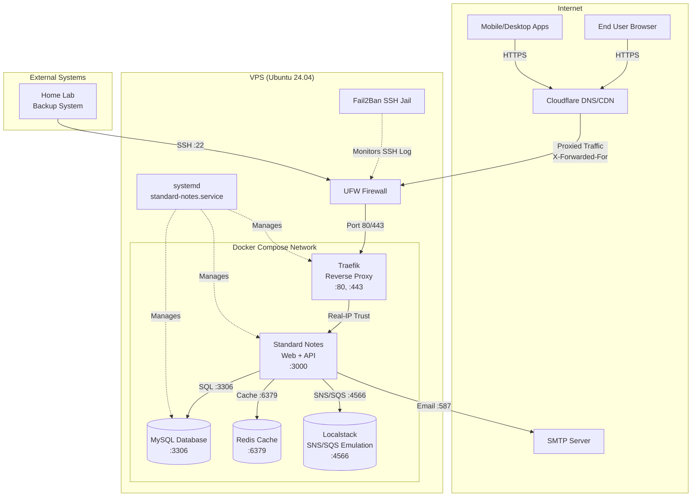
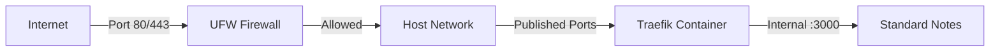
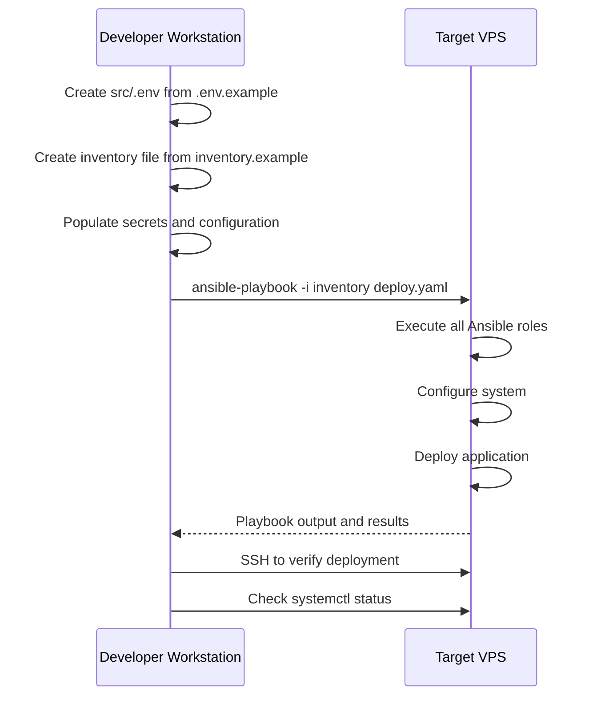

> **Documentation:** [Quick Start](../QUICKSTART.md) | **Architecture** | [Security Design](SECURITY_DESIGN.md) | [Operations](OPERATIONS.md) | [Testing](TESTING.md) | [PRD](PRD.md)

---

# Architecture: Standard Notes IaC

This document provides comprehensive technical design of the Standard Notes Infrastructure as Code deployment system, focused on system architecture, components, data flow, and technology choices.

> [!IMPORTANT]
> This document covers pure architectural design. For security controls and hardening, see [SECURITY_DESIGN.md](SECURITY_DESIGN.md). For operational procedures including backups, upgrades, and troubleshooting, see [OPERATIONS.md](OPERATIONS.md).

## 1. System Overview

### 1.1 High-Level Architecture

The system deploys Standard Notes as a containerized application managed by Docker Compose, with all infrastructure provisioned and configured via Ansible.



### 1.2 Component Inventory

The deployment consists of multiple layers of components, from application containers to infrastructure services. This inventory provides a complete catalog of what gets installed and configured.

#### Core Application Components

- **Standard Notes:** Self-hosted note-taking application (web UI + API backend) - listens on port 3000
- **MySQL:** Relational database for Standard Notes data persistence - listens on port 3306
- **Redis:** Session storage and caching - listens on port 6379
- **Localstack:** SNS/SQS emulation for Standard Notes background jobs - listens on port 4566
- **Traefik:** Reverse proxy, TLS termination, automatic certificate management. Configured to trust Cloudflare forwarded headers.

#### Infrastructure Components

- **Docker Engine:** Container runtime
- **Docker Compose:** Multi-container orchestration
- **systemd:** Service lifecycle management
- **UFW:** Uncomplicated Firewall (iptables frontend)
- **Fail2Ban:** Intrusion detection for SSH. (Web protection via Cloudflare WAF).

#### Management Components

- **Ansible:** Configuration management and deployment automation
- **GitHub Actions:** CI/CD pipeline for automated deployments
- **Backup Scripts:** Database and file backup automation
- **generate-secrets.sh:** Utility script to generate secure random tokens/paasswords for initial setups.

### 1.3 Data Flow Overview

This section describes typical request flows through the system.

#### Web Browser Request Flow

1. User navigates to `https://example.com` or `https://www.example.com` in their browser
2. DNS resolves to VPS public IP (via Cloudflare)
3. UFW firewall allows traffic on port 443
4. Traefik receives HTTPS request on port 443, terminates TLS
5. Traefik routes to Standard Notes container on port 3000 based on hostname (`example.com` or `www.example.com`)
6. Standard Notes processes request, queries MySQL on port 3306 if needed
7. Response flows back through Traefik to user

#### Mobile/Desktop App Request Flow

1. Mobile or desktop app connects to `https://api.example.com` (invisible to end user)
2. DNS resolves to VPS public IP (via Cloudflare)
3. UFW firewall allows traffic on port 443
4. Traefik receives HTTPS request on port 443, terminates TLS
5. Traefik routes to Standard Notes API endpoint on port 3000 based on hostname (`api.example.com`)
6. Standard Notes processes API request, queries MySQL on port 3306
7. Response flows back through Traefik to app

> [!NOTE]
> All traffic between containers uses Docker's internal network. MySQL is never exposed to the host or internet - it only listens on port 3306 within the Docker network. Standard Notes connects to external SMTP server on port 587 (or 25/465 depending on provider) for email delivery.

## 2. Design Philosophy

The architecture is guided by specific principles and conscious trade-offs. Understanding these foundational decisions helps contributors make consistent choices when extending the system.

### 2.1 Core Principles

#### Security by Default

Every component configured with security best practices from initial deployment. No "harden later" approach. All hardening is automated via Ansible.

#### Defense in Depth

Multiple layers of security controls protect the system. See [SECURITY_DESIGN.md](SECURITY_DESIGN.md) for detailed security architecture.

#### Operational Simplicity

Favor simple, well-documented solutions over complex optimizations. A single-server deployment doesn't need Kubernetes orchestration.

#### Idempotency Everywhere

All automation can be safely re-run without side effects. No manual steps, no state drift, no "run once" operations.

### 2.2 Key Trade-offs

Understanding the deliberate trade-offs made in this architecture clarifies design constraints and future evolution possibilities.

#### Chosen: Simplicity over Scalability

Single-server Docker Compose deployment cannot scale horizontally. This is acceptable because:

- Target audience is individuals/small teams
- Vertical scaling (bigger VPS) sufficient for thousands of users
- Complexity of multi-server deployment not justified for use case

#### Chosen: Ansible over Other Tools

Ansible selected as configuration management tool over alternatives:

- **vs Terraform:** Target is existing VPS, not cloud resource provisioning
- **vs Chef/Puppet:** Ansible's agentless architecture simpler for single-server use case  
- **vs Shell Scripts:** Ansible provides idempotency, better error handling, clearer intent

#### Chosen: Docker Compose over Kubernetes

Docker Compose selected over Kubernetes for container orchestration:

- Kubernetes adds significant operational complexity
- Single server negates most Kubernetes benefits (orchestration, scaling, self-healing across nodes)
- Docker Compose health checks combined with systemd provide sufficient self-healing for single-server deployment

## 3. Component Architecture

This section provides detailed technical specifications for each component in the deployment, including container configuration, networking, health checks, and runtime behavior.

### 3.1 Standard Notes Server

The Standard Notes application container runs both the web UI and API backend in a single container. Configuration is injected via environment variables from the `.env` file.

Standard Notes requires supporting services:
- **MySQL 8** - Primary database for users, notes, sessions
- **Redis 6** - Session storage and caching
- **Localstack** - Local AWS SNS/SQS emulation (avoids real AWS costs)

> [!WARNING]
> **Monolithic Container Design**
>
> The Standard Notes `server` container is monolithic: it runs the API server, Web UI, and Worker processes in the same container.
> Even though `docker-compose.yml` maps a separate worker port, the "Worker" logic runs alongside the API in the main process manager.
>
> This design implies that `.env` configuration for the "Worker" (like SQS/SNS emulation) must be present on the main `server` container.

#### Container Configuration

- **Image:** `standardnotes/server:latest` (official image from https://standardnotes.com/help/self-hosting/docker)
- **Service Name:** `server` (matches vendor docker-compose.example.yml)
- **Network:** Internal Docker Compose network `standardnotes_self_hosted`
- **Ports:** 
  - `3000:3000` - Main application HTTP
  - `3125:3104` - Worker process port
- **Volumes:** 
  - `/opt/standard-notes/logs:/var/lib/server/logs` - Application logs (for fail2ban analysis)
  - `/opt/standard-notes/uploads:/opt/server/packages/files/dist/uploads` - User uploads
- **Environment Variables:** Loaded from `.env` file (see Standard Notes `.env.sample` at https://github.com/standardnotes/server/blob/main/.env.sample)

> [!IMPORTANT]
> **PUBLIC_FILES_SERVER_URL Configuration**
>
> The `PUBLIC_FILES_SERVER_URL` environment variable must point to the **API domain** (`api.example.com`), not the web frontend domain (`example.com`).
>
> Example:
> ```bash
> # Correct - points to API backend
> PUBLIC_FILES_SERVER_URL=https://api.example.com/files
>
> # Incorrect - points to web frontend
> PUBLIC_FILES_SERVER_URL=https://example.com/files
> ```
>
> The files server endpoint is part of the API backend (`standardnotes/server` container on port 3000), not the web frontend (`standardnotes/web` container). The web container is nginx serving static assets only. Pointing this URL to the web domain will cause file upload/download failures and authentication issues.

> [!IMPORTANT]
> **CORS_ALLOWED_ORIGINS Configuration**
>
> When using separate domains for web frontend and API backend, the `CORS_ALLOWED_ORIGINS` environment variable must be set to allow cross-origin requests.
>
> Example:
> ```bash
> # Web frontend domain
> DOMAIN=example.com
> # API backend domain  
> API_DOMAIN=api.example.com
> # CORS: Allow web frontend to access API backend
> CORS_ALLOWED_ORIGINS=https://example.com
> ```
>
> Without this configuration, the web frontend will fail authentication after login with 401 errors because the API server rejects cross-origin requests from the web domain.

> [!IMPORTANT]
> **Cookie Configuration for Cross-Subdomain Authentication**
>
> When using separate domains for web frontend and API backend (e.g., `example.com` and `api.example.com`), cookies must be configured to work across subdomains.
>
> Required environment variables:
> ```bash
> COOKIE_DOMAIN=.example.com          # Leading dot allows subdomain sharing  
> COOKIE_SAME_SITE=None               # Required for cross-origin cookies
> COOKIE_SECURE=true                  # Required when SameSite=None (HTTPS only)
> COOKIE_PARTITIONED=false            # Disable partitioning for subdomain sharing
> ```
>
> Without these settings, the browser will not send session cookies from `api.example.com` when the web app at `example.com` makes API requests, causing 401 authentication failures after login.

#### Health Check

HTTP health endpoint check validates application is responding.

```yaml
healthcheck:
  test: ["CMD", "curl", "-f", "http://localhost:3000/healthcheck"]
  interval: 30s
  timeout: 10s
  retries: 3
  start_period: 60s
```

> [!NOTE]
> Health check endpoint `/healthcheck` based on Standard Notes API. Adjust if vendor changes endpoint in future releases.

> [!NOTE]
> **Health Checks in Docker Compose**
>
> Docker health checks monitor container health and enable automatic recovery. When a container's health check fails repeatedly (exceeds `retries`), Docker marks it as `unhealthy`.
>
> The `depends_on` directive with `condition: service_healthy` ensures containers start in the correct order. For example, Standard Notes won't start until MySQL is healthy. This prevents application errors from trying to connect to a database that isn't ready yet.
>
> Combined with restart policies, this creates a self-healing architecture: if MySQL crashes and restarts, Docker Compose can automatically restart dependent services like Standard Notes. The systemd service (`standard-notes.service`) provides an additional layer of recovery - if containers crash, systemd can restart the entire docker-compose stack.
>
> Health checks run inside the container, so they have access to localhost services. A failed health check doesn't immediately restart the container - the restart policy determines that behavior.

> [!WARNING]
> Using `:latest` tag means automatic updates on restart when you pull new images. Users who need version pinning for controlled upgrades should modify `docker-compose.yaml` to use specific tags like `standardnotes/server:1.2.3`.

### 3.2 MySQL Database

MySQL provides persistent data storage for Standard Notes. The database runs as a container with persistent volumes and is accessible only within the Docker internal network.

#### Container Configuration

- **Image:** `mysql:8.0` or `mysql:9.0` (version TBD based on Standard Notes requirements)
- **Network:** Internal Docker Compose network only (not published to host)
- **Ports:** Exposes port 3306 internally within Docker network
- **Volumes:** Bind mount to `/opt/standard-notes/mysql/data/` for persistent database files
- **Environment Variables:** Root password, database name, user credentials

#### Health Check

MySQL connectivity check using `mysqladmin ping` validates database is accepting connections.

```yaml
healthcheck:
  test: ["CMD", "mysqladmin", "ping", "-h", "localhost", "-u", "$$MYSQL_USER", "-p$$MYSQL_PASSWORD"]
  interval: 30s
  timeout: 10s
  retries: 3
  start_period: 60s
```

> [!NOTE]
> **MySQL vs MariaDB**
>
> MySQL and MariaDB are both open-source relational databases with largely compatible SQL syntax and wire protocols. MariaDB is a community-driven fork of MySQL created after Oracle's acquisition of MySQL in 2010.
>
> **Key similarities:**
> - Drop-in replacement for most use cases - same client libraries (libmysqlclient)
> - Compatible SQL syntax for standard operations
> - Similar performance characteristics for small to medium deployments
> - Both support InnoDB storage engine
>
> **Key differences:**
> - MariaDB includes some features not in MySQL (Aria storage engine, thread pool, etc.)
> - MySQL has Oracle's commercial backing and support options
> - Slightly different upgrade/migration paths over time
>
> **Why we chose MySQL:**
> - Broader ecosystem support and documentation
> - Standard Notes official documentation and Docker images assume MySQL
> - More predictable long-term support from Oracle
> - Clearer versioning and release cycle
>
> Users comfortable with MariaDB can substitute the image in `docker-compose.yaml` to `mariadb:10.11` or similar - configuration should be identical for this use case. Just ensure Standard Notes compatibility.

#### Backup Considerations

Database is backed up via `mysqldump` executed by backup scripts with appropriate credentials. See [OPERATIONS.md](OPERATIONS.md) for backup procedures.

### 3.3 Traefik Reverse Proxy

Traefik handles TLS termination, HTTP routing, and automatic Let's Encrypt certificate management. It acts as the entry point for all external HTTPS traffic.

#### Container Configuration

- **Image:** `traefik:v3.0` (or latest stable v3.x)
- **Network:** Docker Compose network + host network binding for ports 80/443
- **Volumes:** 
  - `/opt/standard-notes/traefik/acme.json` (owned by root, mode 600) for TLS certificates
  - `/var/run/docker.sock` (read-only) for Docker container discovery
- **Ports:** 
  - 80 (HTTP) - published to host for Let's Encrypt HTTP challenges and redirect to HTTPS
  - 443 (HTTPS) - published to host for TLS termination
  - 8080 (dashboard) - disabled on public-facing servers

#### Routing Rules

Traefik routes traffic based on hostname:

- `example.com` and `www.example.com` → Standard Notes web UI (port 3000)
- `api.example.com` → Standard Notes API (port 3000, same container different route)

> [!TIP]
> Traefik automatically discovers containers and creates routes based on labels defined in `docker-compose.yaml`. No manual route configuration needed - just add appropriate labels to your service and Traefik picks them up dynamically.

#### TLS Certificate Management

> [!NOTE]
> **Automated TLS with Traefik and Cloudflare**
>
> Traefik integrates with Let's Encrypt to automatically provision and renew TLS certificates at no cost. Using Cloudflare's DNS challenge, Traefik can obtain certificates even before your domain is publicly accessible, and can issue wildcard certificates if needed.
>
> **How it works:**
> 1. Traefik detects new service via Docker labels requesting TLS
> 2. Traefik requests certificate from Let's Encrypt ACME server
> 3. Let's Encrypt issues DNS-01 challenge to prove domain ownership
> 4. Traefik uses Cloudflare API (via API token) to create TXT record `_acme-challenge.example.com`
> 5. Let's Encrypt validates TXT record exists and matches challenge
> 6. Certificate issued and stored in `acme.json`
> 7. Traefik automatically renews certificates before expiration (typically 30 days before 90-day expiry)
>
> **Why DNS challenge vs HTTP challenge:**
> - Works even if your web server is down or not publicly accessible yet
> - Doesn't require port 80 to be publicly accessible during validation
> - Enables wildcard certificates (`*.example.com`) if needed
> - More reliable when deploying from scratch
>
> Just provide your Cloudflare API token (scoped to DNS edit permissions) in the `.env` file and Traefik handles the rest automatically.

Automatic Let's Encrypt certificate provisioning via Cloudflare DNS-01 challenge:

- Cloudflare DNS API token provided via `CLOUDFLARE_DNS_API_TOKEN` environment variable
- Certificates stored in `acme.json` (must be owned by root with permissions 600)
- Auto-renewal handled automatically by Traefik before expiration

#### Health Check

HTTP check on Traefik's ping endpoint validates reverse proxy is running.

```yaml
healthcheck:
  test: ["CMD", "traefik", "healthcheck", "--ping"]
  interval: 30s
  timeout: 10s
  retries: 3
```

### 3.4 Docker Compose Service Definitions

All services defined in `/opt/standard-notes/docker-compose.yaml` with dependencies and health checks properly configured.

```mermaid
graph LR
    subgraph "docker-compose.yaml"
      T[traefik<br/>:80, :443]
      S[standardnotes<br/>:3000]
      M[mysql<br/>:3306]
      R[redis<br/>:6379]
      L[localstack<br/>:4566]
    end
    
    T -->|routes to :3000| S
    S -->|queries :3306| M
    S -->|cache :6379| R
    S -->|sns/sqs :4566| L
    
    T -.->|bind mount| acme[/opt/standard-notes/traefik/acme.json]
    S -.->|bind mount| uploads[/opt/standard-notes/uploads/]
    M -.->|bind mount| dbdata[/opt/standard-notes/mysql/data/]
```

> [!IMPORTANT]
> **All Data in One Directory**
>
> All application data persists in bind mounts under `/opt/standard-notes/`. This design choice means:
> - Service data lives in one directory (secrets are stored separately)
> - Backups are simple: stop service, tar `/opt/standard-notes/`, start service
> - No need to track down Docker named volumes with `docker volume inspect`
> - Migration is easy: copy entire directory to new server
> - Inspection is straightforward: use normal filesystem tools like `ls`, `du`, `find`

## 4. Responsibility Boundaries

Clear separation of responsibilities between tools prevents overlap, reduces complexity, and clarifies what each component handles. This section defines explicit boundaries.

### 4.1 What Ansible Does

Ansible is the configuration management tool that provisions and configures the entire system from a fresh Ubuntu installation to a running Standard Notes deployment.

Ansible work is organized into focused roles to keep responsibilities clear and auditable:

- `system_base` - Base OS configuration, packages, timezone/NTP, hostname/FQDN, and shell prompt policy for privilege awareness.
- `ssh_hardening` - SSH hardening and firewall defaults (authoritative controls in [SECURITY_DESIGN.md](SECURITY_DESIGN.md)).
- `docker_engine` - Removes conflicting packages, installs Docker Engine + Compose plugin from the official repository, and enables the daemon.
- `app_service` - Creates users/groups, lays out `/opt/standard-notes/`, templates `docker-compose.yaml`, `.env`, and Traefik configuration, and installs the systemd unit.
- `backup_restore` - Deploys backup scripts, retention defaults, and sudo rules for `service-backup`.

#### System Configuration

- Create user accounts (`service-deployer`, `service-runner`, `service-backup`)
- Create shared group (`standard-notes`)
- Configure SSH hardening (see [SECURITY_DESIGN.md](SECURITY_DESIGN.md))
- Install and configure UFW firewall rules (see [SECURITY_DESIGN.md](SECURITY_DESIGN.md))
- Install and configure Fail2Ban with jails for SSH and Standard Notes
- Enable automatic security updates (`unattended-upgrades`)
- Install required packages (curl, wget, git, pwgen, etc.)

#### Docker Installation

- Add official Docker APT repository
- Install Docker Engine and Docker Compose plugin
- Configure Docker daemon settings
- Add `service-runner` user to `docker` group for socket access
- Enable Docker service to start on boot

#### Application Deployment

- Create `/opt/standard-notes/` directory structure with proper ownership
- Template `docker-compose.yaml` with user-provided variables from `.env`
- Template `.env` file for container environment variables
- Template Traefik configuration files
- Set proper ownership and permissions on all files and directories
- Create bind mount directories

#### Service Management

- Create systemd service unit file (`/etc/systemd/system/standard-notes.service`)
- Enable service to start automatically on boot
- Configure service to run as `service-runner` user
- Set restart policies for automatic recovery

#### Backup Infrastructure

- Create `/var/backups/standard-notes/` directory owned by `service-backup` user
- Install backup scripts to `/usr/local/bin/backup/`
- Configure sudo permissions for `service-backup` user to access Docker and database

### 4.2 What Docker Compose Does

Docker Compose manages container lifecycle and orchestrates multi-container applications.

Responsibilities:

- Container lifecycle management (start, stop, restart individual containers)
- Network creation and management (internal bridge network)
- Volume mounting (bind mounts to host filesystem)
- Environment variable injection from `.env` file
- Health check execution and status reporting
- Inter-container communication via internal DNS
- Service dependency management (`depends_on` with health conditions)

### 4.3 What systemd Does

The `standard-notes.service` systemd unit provides system-level service management.

Responsibilities:

- Starting Docker Compose stack on system boot
- Restarting Docker Compose stack on failure
- Clean shutdown on system halt or reboot
- Service status reporting (`systemctl status`)
- Logging to journald (system journal)
- Resource limits (if configured)

### 4.4 What Ansible Does NOT Do

Understanding what Ansible explicitly does not handle clarifies user responsibilities.

- **DNS configuration:** Users manually create A/AAAA/CNAME records in their DNS provider
- **VPS provisioning:** Users manually create VPS or use Terraform examples (future enhancement)
- **Network configuration:** Assumes VPS has working internet connectivity and firewall access
- **Cloudflare account setup:** Users must have existing Cloudflare account with API token
- **SMTP server:** Users must provide external SMTP service credentials
- **Application configuration:** Standard Notes-specific settings managed via environment variables
- **Monitoring setup:** Basic health checks only; external monitoring is user responsibility

## 5. Network Architecture

Network design controls traffic flow, implements security boundaries, and defines how components communicate. This architecture uses Docker bridge networking combined with host firewall rules.

### 5.1 Ingress Traffic Flow

External traffic flows through UFW firewall to Traefik, which terminates TLS and routes to appropriate backend service.



#### Public Ports

Only three ports are exposed to the internet:

- **Port 22:** SSH access (may be changed to non-standard port via Ansible configuration variable)
- **Port 80:** HTTP (automatically redirects to HTTPS via Traefik)
- **Port 443:** HTTPS (TLS termination happens here at Traefik)

#### UFW Firewall Rules

UFW rules and hardening settings are defined in [SECURITY_DESIGN.md](SECURITY_DESIGN.md) as the single source of truth.

### 5.2 Internal Communication

Containers communicate over a Docker bridge network isolated from the host. Service discovery happens automatically via Docker's built-in DNS.

All application containers communicate within Docker Compose internal network:

```yaml
# Network definition in docker-compose.yaml
networks:
  internal:
    driver: bridge
    internal: false  # Containers need internet access for SMTP, updates, image pulls
```

#### Service-to-Service Communication

- **Traefik → Standard Notes:** HTTP on port 3000 within Docker network (hostname: `standardnotes`)
- **Standard Notes → MySQL:** MySQL protocol on port 3306 within Docker network (hostname: `mysql`)
- **Standard Notes → SMTP:** External SMTP over internet on port 587, 465, or 25 (user-configured)

> [!NOTE]
> MySQL port 3306 is NOT exposed to the host or internet. It only listens within the Docker network. To access the database from the host for troubleshooting, use `docker exec -it mysql mysql -u root -p` or similar commands.

### 5.3 Egress Traffic

Containers require outbound internet access for several purposes:

- **Docker image pulls:** Downloading container images from Docker Hub
- **Operating system updates:** Ubuntu package updates within containers (if applicable)
- **SMTP email delivery:** Sending emails via external SMTP server
- **Let's Encrypt ACME:** Traefik communicating with Let's Encrypt and Cloudflare APIs
- **Time synchronization:** NTP for accurate timestamps

No egress filtering is applied - all outbound traffic is allowed.

### 5.4 DNS Configuration

Users must manually configure DNS records pointing to their VPS public IP address.

#### Recommended DNS Records

```
A    @                 <VPS_PUBLIC_IP>
CNAME www              @
A    api               <VPS_PUBLIC_IP>
AAAA @                 <VPS_PUBLIC_IPv6>  (optional, if VPS has IPv6)
AAAA api               <VPS_PUBLIC_IPv6>  (optional, if VPS has IPv6)
```

> [!TIP]
> **Why CNAME for www**
>
> Using a CNAME record for `www` pointing to `@` (your root domain) means you only need to update the IP address in one place if your VPS changes. The `www` CNAME automatically follows the `@` A record.
>
> The `api` subdomain should be a separate A record (not CNAME) because:
> - It points to the same IP as `@` but represents a logically different service endpoint
> - Some DNS providers have issues with CNAME chaining
> - A records are slightly faster (no extra DNS lookup)

#### Cloudflare Proxy (Optional)

Cloudflare's orange cloud proxy can be enabled for:

- DDoS protection
- CDN/caching for static assets
- Additional firewall rules
- Analytics

However, the orange cloud is **not required** for basic operation. DNS-only mode (gray cloud) works fine and provides simpler troubleshooting.

## 6. Storage Architecture

Persistent data storage is critical for Standard Notes operation. This section defines filesystem layouts, volume strategies, and data persistence.

### 6.1 Filesystem Layout

Complete directory structure on the deployed VPS. Ownership and permissions are defined in [SECURITY_DESIGN.md](SECURITY_DESIGN.md).

```
/opt/standard-notes/
├── docker-compose.yaml
├── .env
├── localstack_bootstrap.sh
├── logs/
├── uploads/
├── mysql/
│   └── data/
├── redis/
│   └── data/
├── import/                             (optional MySQL init scripts)
└── traefik/
    ├── acme.json
    └── traefik.yaml

/var/backups/standard-notes/
├── sn-backup-20260128.120000.tar.gz
├── sn-backup-20260127.120000.tar.gz
└── ...

/usr/local/bin/backup/
├── sn-backup.sh
└── prune-backups.sh
```

### 6.2 Docker Volume Strategy

This project uses **bind mounts** (absolute paths) instead of named Docker volumes for all persistent data.

#### Bind Mounts in docker-compose.yaml

All volumes use absolute paths under `/opt/standard-notes/`:

```yaml
services:
  mysql:
    volumes:
      - /opt/standard-notes/mysql/data:/var/lib/mysql
  
  standardnotes:
    volumes:
      - /opt/standard-notes/uploads:/app/uploads
  
  traefik:
    volumes:
      - /opt/standard-notes/traefik/acme.json:/acme.json
      - /var/run/docker.sock:/var/run/docker.sock:ro
```

> [!TIP]
> **Bind Mounts vs Named Volumes**
>
> This project deliberately chooses bind mounts over Docker named volumes for several operational reasons:
>
> **Advantages of bind mounts:**
> - **Easier backups:** Direct filesystem access - just tar up `/opt/standard-notes/`
> - **Easier inspection:** Browse files with standard tools (`ls`, `du`, `tree`, etc.)
> - **Easier migration:** Copy entire directory to move service to new server
> - **Centralized storage:** Everything related to the service lives in one known location
> - **Simpler permissions:** Standard Linux file permissions and ownership
>
> **Named volumes would require:**
> - `docker volume inspect` to find data location (usually `/var/lib/docker/volumes/...`)
> - `docker cp` or volume mounts for backup access
> - More complex backup scripts
> - Less intuitive for users unfamiliar with Docker internals
>
> For a single-server deployment where we control the entire system, bind mounts provide superior operational simplicity without significant downsides.

### 6.3 Backup Philosophy

Everything needed to restore the Standard Notes service data lives under `/opt/standard-notes/`, while secrets are stored separately. Backup contents and exclusions are defined in [OPERATIONS.md](OPERATIONS.md) as the single source of truth.

The backup workflow:

1. Stop the service: `systemctl stop standard-notes`
2. Dump the database
3. Create tarball of `/opt/standard-notes/`
4. Start the service: `systemctl start standard-notes`

This approach guarantees 100% of service-related data is captured. See [OPERATIONS.md](OPERATIONS.md) for detailed backup procedures.

Environment configuration is stored separately (password manager or secrets vault) and is not included in backups.

### 6.4 Disk Space Planning

Understanding storage requirements helps users size their VPS appropriately.

#### Minimum Disk Usage Estimate

- Operating system (Ubuntu 24.04): ~5 GB
- Docker images (Traefik, Standard Notes, MySQL): ~2 GB
- Standard Notes application + MySQL overhead: ~500 MB
- User data (notes, uploaded files): Variable - plan for 10+ GB
- Local backups (before pull to external storage): 3-5x user data size
- System logs and overhead: ~2 GB

**Recommended minimum:** 80 GB disk

**Recommended for production:** 200+ GB disk, depending on expected user data growth

## 7. Technology Choices and Rationale

Specific versions and technologies were chosen deliberately based on project requirements, community support, and operational simplicity. This section documents tool choices and their justification.

### 7.1 Ansible

**Version Required:** 2.14 or newer

**Collections Required:**

- `community.general` - General system utilities and tools
- `community.docker` - Docker installation and management
- `ansible.posix` - POSIX system tools (firewall, cron, etc.)

**Why Ansible:**

- **Agentless:** Uses SSH only, no additional software on target VPS
- **Declarative:** Describes desired state, not procedural steps
- **Idempotent:** Can safely re-run playbooks without side effects
- **Excellent templating:** Jinja2 templating for configuration files
- **Large ecosystem:** Extensive role and module community
- **Better than shell scripts:** Structured, error handling, clear intent, reusable

### 7.2 Docker and Docker Compose

**Docker Engine Version:** 24.0 or newer

**Docker Compose Version:** 2.20 or newer (via plugin, not standalone v1)

**Why Docker:**

- **Isolation:** Each service runs in isolated container
- **Portability:** Same container runs anywhere Docker runs
- **Easy rollback:** Switch to different image tag to roll back
- **Health checks:** Built-in container health monitoring
- **Industry standard:** Broad community support and tooling

**Why Docker Compose (not Kubernetes):**

- **Simplicity:** YAML configuration is straightforward
- **Sufficient for single-server:** All orchestration features needed
- **Built-in networking:** Automatic service discovery via DNS
- **No complexity overhead:** Kubernetes is overkill for this use case
- **Mature and stable:** Long-established tool with excellent documentation

### 7.3 Standard Notes

**Version Strategy:** `:latest` Docker tag following official guidance at https://standardnotes.com/help/self-hosting/docker

**Upgrade Process:** Manual pull and recreate
```bash
docker compose pull
docker compose up -d --force-recreate
```

**Official Image:** `standardnotes/server` on Docker Hub (https://hub.docker.com/r/standardnotes/server)

**Database Migrations:** Handled automatically on container restart (no manual intervention required)

**Why Standard Notes:**

- **Open source:** Fully open source and auditable
- **Privacy-focused:** End-to-end encryption, self-hosting supported
- **Active development:** Regular updates and security patches
- **Self-hosting supported:** Official documentation for self-hosted deployment
- **Cross-platform:** Web, mobile (iOS/Android), desktop (Windows/macOS/Linux)

### 7.4 Ubuntu 24.04 LTS

**Why Ubuntu:**

- **Long-term support:** Security updates until 2029
- **Predictable package versions:** Stable release cycle
- **Large community:** Extensive documentation and community support
- **Industry standard:** Widely used for server deployments
- **Well-tested:** Mature platform with known behavior

**Why 24.04 specifically:**

- **Modern Docker:** Latest Docker Engine versions in official repositories
- **Modern systemd:** Latest service management features
- **Recent kernel:** Current security features and performance improvements
- **10-year support:** Extended support available if needed
- **Current LTS:** Recently released, long runway before EOL

### 7.5 Traefik

**Why Traefik (not Nginx/Caddy):**

- **Automatic service discovery:** Reads Docker labels, no manual configuration
- **Built-in Let's Encrypt:** Native ACME support with automatic renewal
- **Modern design:** Built for containers and microservices
- **Dynamic configuration:** Updates routes without restart
- **Excellent documentation:** Clear examples for Docker Compose

### 7.6 MySQL

**Why MySQL (not PostgreSQL/MariaDB):**

- **Standard Notes compatibility:** Official documentation assumes MySQL
- **Broad ecosystem:** Extensive tooling and community support
- **Predictable support:** Oracle backing provides long-term stability
- **Clear versioning:** Straightforward upgrade path

## 8. Directory Structure

The repository follows GitHub folder conventions and separates concerns clearly. The deployed VPS uses Filesystem Hierarchy Standard (FHS) conventions.

### 8.1 Repository Layout

```
standard-notes-iac/
├── README.md                           # User-facing documentation
├── LICENSE                             # MIT license
├── CONTRIBUTING.md                     # Contribution guidelines
├── STYLE_GUIDE.md                      # Documentation and code standards
├── .gitignore                          # Git ignore patterns
├── .github/
│   ├── copilot-instructions.md         # LLM behavior enforcement
│   └── workflows/
│       └── deploy.yaml                 # GitHub Actions deployment workflow
├── docs/                               # Design and contributor documentation
│   ├── PRD.md                          # Product requirements
│   ├── ARCHITECTURE.md                 # System architecture (this doc)
│   ├── SECURITY_DESIGN.md              # Security architecture and hardening
│   └── OPERATIONS.md                   # Operational procedures
└── src/                                # All implementation code
    ├── .env.example                    # Template for secrets/configuration
    ├── ansible.cfg                     # Ansible configuration
    ├── inventory.example               # Template for inventory file
    ├── deploy.yaml                     # Main Ansible playbook
    ├── roles/                          # Ansible roles
    │   ├── common/                     # Base system setup
    │   ├── users/                      # User account creation
    │   ├── ssh-hardening/              # SSH security configuration
    │   ├── firewall/                   # UFW firewall setup
    │   ├── fail2ban/                   # IDS/IPS configuration
    │   ├── docker/                     # Docker installation
    │   ├── motd/                       # Dynamic MOTD system (see docs/MOTD.md)
    │   ├── backup/                     # Backup scripts installation
    │   └── standardnotes/              # Application deployment
    └── templates/                      # Jinja2 templates
        ├── docker-compose.yaml.j2      # Docker Compose template
        ├── env.j2                      # Environment file template
        ├── standard-notes.service.j2   # systemd unit template
        ├── traefik.yaml.j2             # Traefik config template
        ├── sn-backup.sh.j2             # Backup script template
        └── prune-backups.sh.j2         # Prune script template
```

### 8.2 VPS Filesystem Layout

See section 6.1 for detailed filesystem layout on deployed VPS.

## 9. Deployment Flow

Deployment follows a specific sequence whether run via GitHub Actions or locally. Understanding this flow aids troubleshooting, customization, and extension.

### 9.1 GitHub Actions Deployment Flow

```mermaid
sequenceDiagram
    participant Dev as Developer
    participant GH as GitHub Actions
    participant VPS as Target VPS
    
    Dev->>GH: Push to main branch
    GH->>GH: Load secrets and variables
    GH->>GH: Install Ansible via pip
├── localstack_bootstrap.sh
    GH->>GH: Setup SSH key from secret
    GH->>VPS: SSH connection as service-deployer
    GH->>VPS: Run ansible-playbook deploy.yaml
    VPS->>VPS: Execute all Ansible roles
    VPS->>VPS: Configure system, install Docker
    VPS->>VPS: Deploy docker-compose stack
    VPS->>VPS: Start systemd service
    VPS->>VPS: Wait for health checks
    VPS-->>GH: Deployment success/failure
    GH-->>Dev: Workflow result notification
```

### 9.2 Local Manual Deployment Flow



### 9.3 Detailed Deployment Steps

Ansible playbook executes roles in this specific order:

#### 1. Pre-flight Checks

- Verify target OS is Ubuntu 24.04 LTS
- Test SSH connectivity
- Verify sudo access works
- Gather system facts

#### 2. Role: common

- Update APT package cache
- Install base packages: `curl`, `wget`, `git`, `pwgen`, `vim`, `htop`
- Configure system timezone (default UTC)
- Configure system locale
- Enable and configure `unattended-upgrades` for automatic security updates

#### 3. Role: users

- Create `service-deployer` user with sudo privileges
- Create `service-runner` user (limited sudo for systemd)
- Create `service-backup` user (limited sudo for backups)
- Create `standard-notes` shared group
- Add `service-runner` and `service-backup` to `standard-notes` group
- Configure sudoers files for limited sudo permissions

#### 4. Role: ssh-hardening

- Disable password authentication
- Disable root login
- Configure `PubkeyAuthentication yes`
- Add authorized SSH keys for `service-deployer`
- Optionally change SSH port (if configured)
- Restart SSH service

#### 5. Role: firewall

- Install UFW (Uncomplicated Firewall)
- Configure default deny incoming, allow outgoing
- Allow SSH port (22 or custom)
- Allow HTTP port (80)
- Allow HTTPS port (443)
- Enable UFW

#### 6. Role: fail2ban

- Install Fail2Ban package
- Configure SSH jail (ban after 5 failed attempts, 10 minute ban time)
- Enable and start Fail2Ban service

> [!NOTE]
> **Standard Notes Jail - v1.1 Feature**
>
> Standard Notes Fail2Ban jail deferred to v1.1 pending log analysis:
> - No publicly available Standard Notes filters found
> - Requires deployed instance to analyze log format
> - Need to identify failed login patterns and attack vectors
> - v1.0 includes SSH jail only (primary attack surface)
>
> See GitHub issue #TBD for tracking Standard Notes jail implementation.

#### 7. Role: docker_engine

- Add Docker official APT repository
- Install Docker Engine
- Install Docker Compose plugin (v2)
- Add `service-runner` user to `docker` group
- Configure Docker daemon settings
- Enable Docker service to start on boot

#### 8. Role: backup_restore

- Create `/var/backups/standard-notes/` directory
- Set ownership and permissions per [SECURITY_DESIGN.md](SECURITY_DESIGN.md)
- Template backup scripts to `/usr/local/bin/backup/`
- Set executable permissions on scripts
- Configure sudo rules for `service-backup` user

#### 9. Role: app_service

- Create `/opt/standard-notes/` directory structure
- Set ownership and permissions per [SECURITY_DESIGN.md](SECURITY_DESIGN.md)
- Template `docker-compose.yaml` with user variables
- Template `.env` file with secrets
- Template Traefik configuration
- Create empty `acme.json` file with ownership and permissions per [SECURITY_DESIGN.md](SECURITY_DESIGN.md)
- Template systemd service file
- Enable systemd service
- Pull Docker images
- Start systemd service
- Wait for all health checks to pass

#### 10. Post-Deployment Verification

- Check systemd service status
- Verify all containers are healthy
- Display access URLs to user
- Provide next steps (DNS configuration, etc.)

## 10. Scalability Considerations

This architecture prioritizes simplicity over scalability. Understanding scaling limitations helps users set appropriate expectations and plan for future growth.

### 10.1 Single-Server Limitations

Current architecture has fundamental scalability constraints:

- **No horizontal scaling:** Cannot add more servers to increase capacity
- **No load balancing:** Single Traefik instance is single point of entry
- **No database replication:** Single MySQL instance, no read replicas
- **No session sharing:** All user sessions tied to single server
- **No distributed file storage:** Uploaded files stored locally only
- **No geographic distribution:** Single datacenter location

### 10.2 Vertical Scaling Capability

Scaling up (larger VPS) is fully supported:

- Increase CPU cores for more concurrent request handling
- Increase RAM for larger database cache and more simultaneous connections
- Increase disk space for more user data
- Re-run Ansible playbook (no changes needed - automatically detects and uses new resources)
- Optionally adjust Docker resource limits in `docker-compose.yaml`

Expected capacity per server size:

- **4 GB RAM, 2 CPU:** ~100-500 active users
- **8 GB RAM, 4 CPU:** ~500-2000 active users
- **16 GB RAM, 8 CPU:** ~2000-5000 active users

> [!NOTE]
> These are rough estimates. Actual capacity depends on usage patterns: note count, file uploads, API call frequency, encryption overhead, etc.

### 10.3 Horizontal Scaling (Future Architecture)

Not in scope for v1.0, but potential multi-server architecture would require:

**Load Balancing:**
- Multiple Standard Notes application servers
- Load balancer (additional Traefik instance, HAProxy, or cloud LB)
- Session persistence (sticky sessions or shared session storage)

**Database Scaling:**
- MySQL replication (primary-replica setup)
- Or managed database service (RDS, Cloud SQL, etc.)
- Connection pooling

**Shared Storage:**
- NFS/GlusterFS for shared file uploads
- Or object storage (S3, MinIO, etc.)
- Consistent cache layer (Redis/Memcached)

**Deployment Complexity:**
- Orchestration tool (Kubernetes, Docker Swarm)
- Service mesh for inter-service communication
- Centralized logging and monitoring
- Database migration coordination

This level of complexity is not justified for the target audience and use case.

## 11. Known Limitations

Every architecture makes deliberate trade-offs. Being explicit about limitations prevents misaligned expectations and guides users toward appropriate use cases.

### 11.1 Single Point of Failure

**Limitation:** Entire deployment runs on single VPS. If VPS becomes unavailable, service is completely down.

**Impact:** No high availability, no automatic failover

**Mitigation Strategies:**
- Choose reliable VPS provider with high uptime SLA
- Maintain recent backups (see [OPERATIONS.md](OPERATIONS.md))
- Document and test restore procedures
- Consider VPS provider's backup/snapshot features

### 11.2 No Automatic Failover

**Limitation:** No automatic failover to backup server if primary fails.

**Impact:** Manual intervention required to restore service

**Mitigation Strategies:**
- Document clear restore procedures
- Keep backup restore process well-tested
- Maintain automated backups to off-site storage
- Consider standby VPS for critical deployments (manual failover)

### 11.3 Backup Storage on Same Server

**Limitation:** Backups initially stored on same VPS until pulled to external storage.

**Impact:** If VPS catastrophically fails before backup pull, recent data may be lost

**Mitigation Strategies:**
- Frequent backup pulls to external storage (home lab, NAS, S3)
- Automate backup pulls on regular schedule
- Monitor backup pull success
- Consider VPS provider snapshots as additional layer

### 11.4 Limited Monitoring

**Limitation:** Only Docker health checks provided, no advanced metrics, alerting, or observability.

**Impact:** Limited visibility into system behavior, no proactive alerting

**Mitigation Strategies:**
- Users can add external monitoring (see [OPERATIONS.md](OPERATIONS.md) for recommendations)
- Use Docker health checks for basic status
- Monitor logs via `journalctl` and `docker compose logs`
- Consider external uptime monitoring services

### 11.5 Platform Lock-in

**Limitation:** Only Ubuntu 24.04 LTS supported initially.

**Impact:** Cannot deploy on Debian, Rocky Linux, Alpine, or other distributions without modifications

**Mitigation Strategies:**
- Ubuntu 24.04 has long support lifecycle (until 2029)
- Future versions may support additional platforms
- Ansible roles could be adapted by advanced users
- Docker portability means containers themselves are platform-agnostic

### 11.6 No Built-in Disaster Recovery Testing

**Limitation:** No automated disaster recovery testing or restore validation.

**Impact:** Restore procedures may not work when needed if untested

**Mitigation Strategies:**
- Document restore procedures clearly
- Periodically test restore on separate test VPS
- Include restore testing in operational runbook
- Consider automated restore testing as future enhancement

## 12. Future Architecture Enhancements

While not in current scope, these architectural improvements may be valuable in future versions. Documenting them helps guide roadmap planning and community contributions.

### 12.1 Terraform Cloud Provisioning Examples

Provide example Terraform modules for provisioning VPS on popular providers:

- AWS EC2
- DigitalOcean Droplets
- Hetzner Cloud
- Linode
- Vultr

Benefits: End-to-end infrastructure-as-code, reproducible VPS creation

### 12.2 Additional Platform Support

Extend Ansible playbooks to support:

- Debian 12
- Rocky Linux 9
- AlmaLinux 9
- Fedora Server

Benefits: Broader platform compatibility, reduced Ubuntu lock-in

### 12.3 Alternative TLS Providers

Support for non-Cloudflare DNS providers:

- Route53 (AWS)
- Google Cloud DNS
- HTTP-01 challenge (certbot) for providers without DNS API

Benefits: Reduces Cloudflare dependency

### 12.4 Observability Stack

Optional Ansible role for deploying monitoring:

- Prometheus for metrics collection
- Grafana for visualization
- Loki for log aggregation
- Alertmanager for notifications

Benefits: Production-grade observability without external services

### 12.5 High Availability Architecture

Multi-server architecture with:

- Load balanced application servers
- Database replication
- Shared storage
- Automated failover

Benefits: Eliminates single point of failure, enables horizontal scaling

Note: Significantly increases complexity - only justified for larger deployments

### 12.6 Automated Testing

Implement testing infrastructure:

- Molecule for Ansible role testing
- Testinfra for deployed system validation
- GitHub Actions CI for automated testing
- Restore procedure validation

Benefits: Improved quality, faster development, confidence in changes

> [!NOTE]
> Feature requests and architecture proposals should be filed as GitHub issues with clear use case justification and consideration of complexity vs. benefit trade-offs.
