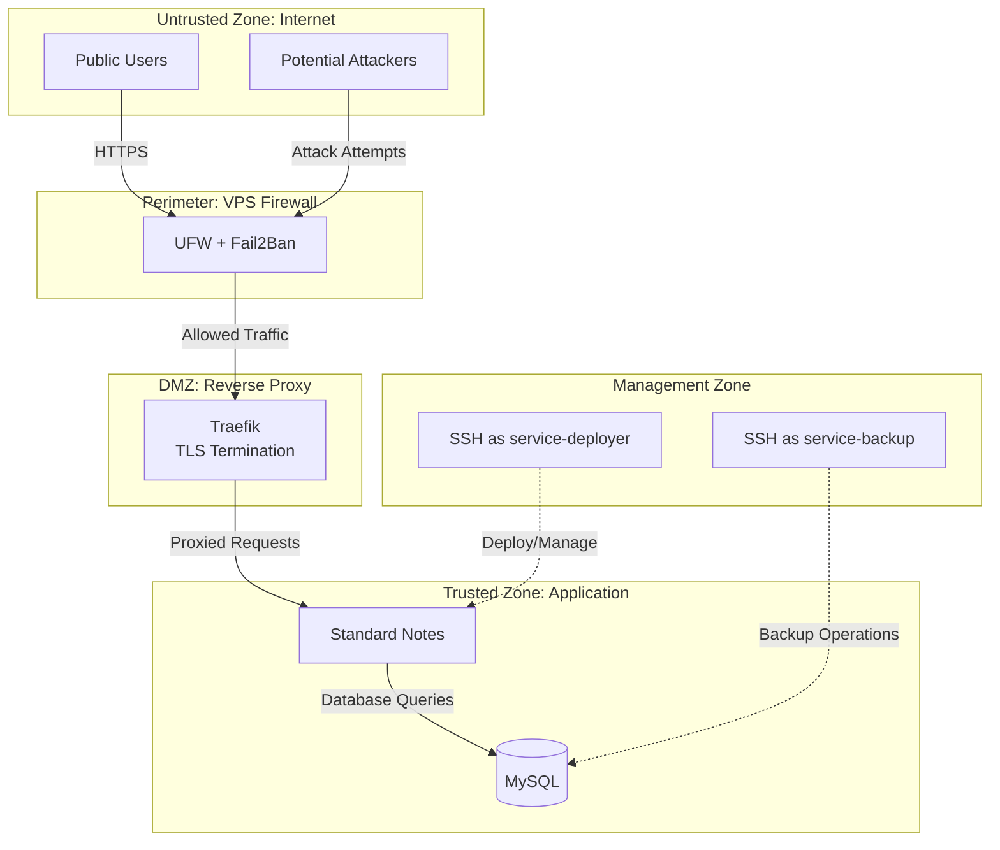
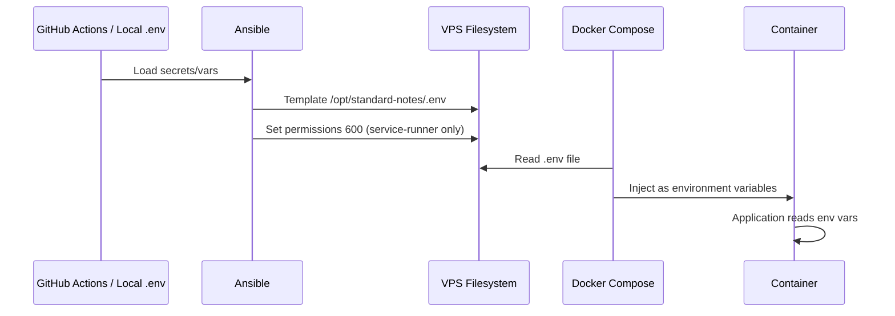

> **Documentation:** [Quick Start](../QUICKSTART.md) | [Architecture](ARCHITECTURE.md) | **Security Design** | [Operations](OPERATIONS.md) | [Testing](TESTING.md) | [PRD](PRD.md)

---

# Security Design: Standard Notes IaC

This document defines the security architecture, hardening measures, secrets management, and security controls for the Standard Notes deployment.

> [!IMPORTANT]
> Security is a primary design consideration, not an afterthought. All security controls described here are implemented automatically during deployment via Ansible.

## 1. Security Philosophy

### 1.1 Defense in Depth

Security is implemented through multiple independent layers. Compromise of one layer does not compromise the entire system.

**Security Layers:**

1. **Network Perimeter:** UFW firewall blocks all non-essential ports
2. **Intrusion Detection:** Fail2Ban detects and blocks malicious activity
3. **Access Control:** SSH key-based authentication only, no passwords
4. **User Separation:** Least-privilege user accounts limit blast radius
5. **Container Isolation:** Docker provides process and filesystem isolation
6. **Encryption:** TLS for data in transit, Standard Notes client-side encryption for data at rest

### 1.2 Security by Default

Every component is configured with security best practices from initial deployment:

- No "deploy first, harden later" approach
- All hardening automated via Ansible
- No manual security configuration required
- Secure defaults, no insecure fallbacks

### 1.3 Least Privilege Principle

Every user account and service has only the minimum permissions required for its function. Privilege escalation requires deliberate action and leaves audit trail.

## 2. Trust Boundaries

Understanding trust zones clarifies where authentication, authorization, and encryption occur, and what level of trust exists between components.

### 2.1 Trust Zones



### 2.2 Zone Descriptions

#### Untrusted Zone (Internet)

- All external users and potential attackers
- No trust assumptions
- All traffic treated as potentially malicious
- Must authenticate to access resources

#### Perimeter (Firewall)

- First line of defense
- UFW blocks all ports except 22, 80, 443
- Fail2Ban monitors SSH (Port 22) for brute force attacks
- Cloudflare WAF protects Web (Ports 80/443) from application attacks
- Drops malicious traffic before it reaches services

#### DMZ (Traefik)

- TLS termination happens here
- Routes traffic based on hostname
- Configured to trust Cloudflare IPs (Orange Cloud) for correct X-Forwarded-For handling
- Limited trust - can be exploited if Traefik has vulnerability
- Does not handle authentication (passed to application)

#### Trusted Zone (Application)

- Standard Notes and MySQL
- Assumes requests from Traefik are properly formed
- Standard Notes handles user authentication
- MySQL trusts connections from Standard Notes container

#### Management Zone (SSH Access)

- Administrative access to system
- Highest privilege level
- Protected by SSH key authentication
- All actions logged

### 2.3 Authentication Boundaries

#### User Authentication (Application Level)

Standard Notes handles all end-user authentication:

- User account creation and login
- Session management
- Password hashing and validation
- Two-factor authentication (if supported by Standard Notes)

**This project does not implement authentication on top of Standard Notes.**

#### Administrative Authentication (System Level)

System access requires SSH key authentication:

- Public key authentication only
- No password authentication allowed
- Each administrator has unique key
- Keys can be individually revoked

## 3. Secrets and Configuration Management

Proper secrets management is critical for security in a public repository. All sensitive credentials must be kept out of version control and injected at deployment time.

### 3.1 What Qualifies as a Secret

Secrets that must never be committed to version control:

- MySQL root password
- MySQL user password
- Standard Notes encryption keys
- Standard Notes JWT secrets
- SMTP credentials (username, password)
- Cloudflare API tokens
- SSH private keys
- Any API keys or access tokens

### 3.2 Automated Secrets Generation

This project emphasizes **Automated Deployment**. To resolve the tension between automation and secrets management, Ansible is responsible for generating secure secrets on the initial deployment.

1.  **First Run:** Ansible checks for existing `.env`.
2.  **Generation:** If missing, Ansible generates cryptographically secure random values for all required keys (using `openssl rand` or similar).
3.  **Persistence:** Secrets are written to `src/.env` (local) or injected into the target environment.
4.  **Retrieval:** The user must SSH into the server to retrieve the generated `.env` file and save it to their secure password manager.

> [!TIP]
> **Why this approach?**
>
> Asking users to manually run `openssl` 10 times before deploying breaks the goal of "Automated Deployment."
> By having the machine generate the secrets locally, we ensure high entropy without user friction.
> Users retain full control by retrieving the generated file.

### 3.3 GitHub Actions Secrets Model

When deploying via GitHub Actions, secrets are stored in GitHub Actions secrets and variables.

#### GitHub Actions Secrets

Encrypted and never exposed in logs:

```
MYSQL_ROOT_PASSWORD
MYSQL_PASSWORD
REDIS_PASSWORD
AUTH_JWT_SECRET
VALET_TOKEN_SECRET
ENCRYPTION_SERVER_KEY
SMTP_PASSWORD
CLOUDFLARE_DNS_API_TOKEN
SSH_PRIVATE_KEY
```

#### GitHub Actions Variables

Non-sensitive configuration (visible in logs):

```
TARGET_HOST
DOMAIN
API_DOMAIN
MYSQL_DATABASE
MYSQL_USER
REDIS_HOST
REDIS_PORT
SMTP_HOST
SMTP_PORT
SMTP_USERNAME
SMTP_FROM
LETSENCRYPT_EMAIL
TZ
```

### 3.3 Local Deployment Secrets Model

When deploying locally, all secrets and configuration live in `src/.env` file.

The `.env` file is the union of the vendor Standard Notes `.env.sample` variables plus this project's variables for Cloudflare, Let's Encrypt, and timezone configuration.

#### .env File Structure

```bash
# Domain configuration
DOMAIN=example.com
API_DOMAIN=api.example.com
PUBLIC_FILES_SERVER_URL=https://api.example.com/files

# CORS configuration
CORS_ALLOWED_ORIGINS=https://example.com

# Cookie configuration (for cross-subdomain authentication)
COOKIE_DOMAIN=.example.com
COOKIE_SAME_SITE=None
COOKIE_SECURE=true

# MySQL configuration
MYSQL_ROOT_PASSWORD=<generated-secret>
MYSQL_DATABASE=standard_notes
MYSQL_USER=standard_notes_user
MYSQL_PASSWORD=<generated-secret>

# Redis configuration
REDIS_HOST=cache
REDIS_PORT=6379
REDIS_PASSWORD=<generated-secret>

# Standard Notes configuration
AUTH_JWT_SECRET=<generated-secret>
VALET_TOKEN_SECRET=<generated-secret>
ENCRYPTION_SERVER_KEY=<generated-secret>

# SMTP configuration (optional)
SMTP_HOST=smtp.example.com
SMTP_PORT=587
SMTP_USERNAME=noreply@example.com
SMTP_PASSWORD=<generated-secret>
SMTP_FROM_ADDRESS=noreply@example.com

# Cloudflare and Let's Encrypt configuration
CLOUDFLARE_DNS_API_TOKEN=<cloudflare-dns-api-token>
LETSENCRYPT_EMAIL=you@example.com

# Timezone
TZ=America/New_York
```

> [!IMPORTANT]
> **Never Commit .env to Version Control**
>
> The `src/.env` file **MUST** be listed in `.gitignore` and never committed to the repository. This file contains production secrets that would compromise your deployment if exposed.
>
> Always use `src/.env.example` as a template with placeholder values only. Users copy `.env.example` to `.env` and populate with real secrets.
>
> **Verify .env is ignored:**
> ```bash
> git check-ignore src/.env
> # Should output: src/.env
> ```

### 3.4 Secret Generation

Cryptographically secure secrets should be generated using proper random number generators.

#### Generating Secure Passwords and Keys

Use `pwgen` for password generation (preferred):

```bash
# Install pwgen
sudo apt install pwgen

# Generate 32-character password with symbols
pwgen -s -y 32 1

# Generate multiple secrets at once
pwgen -s -y 32 5
```

Alternative using `openssl`:

```bash
# Generate base64-encoded random string (32 bytes = 44 chars base64)
openssl rand -base64 32

# Generate hex-encoded random string (32 bytes = 64 chars hex)
openssl rand -hex 32
```

#### Example Secret Generation Workflow

```bash
# Generate all required secrets
echo "MYSQL_ROOT_PASSWORD=$(pwgen -s -y 32 1)"
echo "MYSQL_PASSWORD=$(pwgen -s -y 32 1)"
echo "REDIS_PASSWORD=$(pwgen -s -y 32 1)"
echo "AUTH_JWT_SECRET=$(openssl rand -hex 32)"
echo "VALET_TOKEN_SECRET=$(openssl rand -hex 32)"
echo "ENCRYPTION_SERVER_KEY=$(openssl rand -hex 32)"
```

> [!TIP]
> Use `pwgen -s -y 32 1` for database passwords (symbols allowed). Use `openssl rand -hex 32` for application secret keys (hexadecimal only for better compatibility).

### 3.5 Configuration Injection Flow

How secrets flow from source to deployed containers:



### 3.6 Inventory Strategy

#### Static Inventory (Local Deployment)

Create `src/inventory` file defining target host(s):

```ini
[standardnotes]
example.com ansible_user=service-deployer ansible_ssh_private_key_file=~/.ssh/id_ed25519
```

#### Dynamic Inventory (GitHub Actions)

Generated from GitHub Actions variables:

```yaml
# In GitHub Actions workflow
- name: Create inventory
  run: |
    echo "[standardnotes]" > inventory
    echo "${{ vars.TARGET_HOST }} ansible_user=service-deployer" >> inventory
```

SSH key loaded from GitHub Actions secret.

### 3.7 Variable Precedence

Ansible loads variables in this precedence order (highest to lowest):

1. Extra vars from command line: `ansible-playbook -e "var=value"`
2. GitHub Actions secrets/variables
3. Local `.env` file
4. Ansible role defaults

## 4. User Account Separation

User account separation limits the blast radius of potential compromises. If one account is compromised, damage is contained.

### 4.1 User Accounts

#### service-deployer

**Purpose:** Deployment and system administration

**Permissions:**
- SSH access with public key authentication
- Full sudo access for deployment tasks
- Can run Ansible playbooks
- Can modify system configuration

**sudo configuration:**
```
service-deployer ALL=(ALL) NOPASSWD:ALL
```

**Use cases:**
- Initial deployment via Ansible
- System updates and maintenance
- Emergency recovery

#### service-runner

**Purpose:** Run the Standard Notes application

**Permissions:**
- Owns `/opt/standard-notes/` directory
- Member of `standard-notes` group
- Member of `docker` group (for Docker socket access)
- Limited sudo for systemd service control only

**sudo configuration:**
```
service-runner ALL=(ALL) NOPASSWD: /usr/bin/systemctl start standard-notes
service-runner ALL=(ALL) NOPASSWD: /usr/bin/systemctl stop standard-notes
service-runner ALL=(ALL) NOPASSWD: /usr/bin/systemctl restart standard-notes
service-runner ALL=(ALL) NOPASSWD: /usr/bin/systemctl enable standard-notes
service-runner ALL=(ALL) NOPASSWD: /usr/bin/systemctl disable standard-notes
service-runner ALL=(ALL) NOPASSWD: /usr/bin/systemctl status standard-notes
```

**Use cases:**
- Start/stop/restart application service
- View service status
- Docker container management

#### service-backup

**Purpose:** Backup operations

**Permissions:**
- Owns `/var/backups/standard-notes/` directory
- Member of `standard-notes` group (read access to `/opt/standard-notes/`)
- SSH access with public key authentication
- Limited sudo for backup operations

**sudo configuration:**
```
service-backup ALL=(ALL) NOPASSWD: /usr/bin/docker exec mysql mysqldump *
service-backup ALL=(ALL) NOPASSWD: /usr/local/bin/backup/sn-backup.sh
service-backup ALL=(ALL) NOPASSWD: /usr/local/bin/backup/prune-backups.sh
```

**Use cases:**
- Execute backup scripts
- Access database for dumps
- Prune old backups

#### standard-notes group

**Purpose:** Shared access control

**Members:**
- `service-runner`
- `service-backup`

**Permissions:**
- Group read access to `/opt/standard-notes/`

### 4.2 Directory Ownership and Permissions

```
/opt/standard-notes/                    service-runner:standard-notes  750
├── docker-compose.yaml                 service-runner:standard-notes  640
├── .env                                service-runner:standard-notes  600
├── traefik/
│   ├── acme.json                       root:root                      600
│   └── traefik.yaml                    service-runner:standard-notes  640
├── uploads/                            container-uid:container-gid    755
├── mysql/
│   └── data/                           container-uid:container-gid    755
└── redis/
    └── data/                           container-uid:container-gid    755

/var/backups/standard-notes/            service-backup:service-backup  750
├── *.tar.gz                            service-backup:service-backup  640

/usr/local/bin/backup/                  root:root                      755
├── sn-backup.sh                        root:root                      755
└── prune-backups.sh                    root:root                      755
```

### 4.3 Compromise Scenarios and Mitigation

#### Scenario: Standard Notes Application Compromised

**Attack Vector:** Remote code execution vulnerability in Standard Notes

**Attacker Gains:**
- `service-runner` user access
- Read access to `/opt/standard-notes/`
- Ability to access Docker socket
- Limited systemd service control

**Attacker CANNOT:**
- Access backup archives in `/var/backups/standard-notes/` (different owner)
- SSH as `service-backup` to exfiltrate backups remotely
- Modify backup scripts in `/usr/local/bin/backup/` (owned by root)
- Gain root access easily (limited sudo scope)

**Mitigation:**
1. Detect compromise via monitoring and logs
2. SSH as `service-deployer` from trusted location
3. Stop services: `sudo systemctl stop standard-notes`
4. Review logs for malicious activity
5. Restore from known-good backup
6. Rotate all secrets (MySQL passwords, Standard Notes keys, etc.)
7. Re-run Ansible playbook to reset configuration

#### Scenario: service-backup User Compromised

**Attack Vector:** SSH key stolen from backup system

**Attacker Gains:**
- SSH access as `service-backup`
- Read access to `/opt/standard-notes/` via group membership
- Ability to execute backup scripts
- Access to backup archives

**Attacker CANNOT:**
- Modify running application
- Control Docker containers
- Access service as `service-runner` or `service-deployer`

**Mitigation:**
1. Rotate SSH key for `service-backup`
2. Review backup access logs
3. Assume backup files potentially compromised
4. Consider rotating application secrets if exposure is suspected
5. Add additional access controls if needed

## 5. Network Security

Network security controls protect data in transit, limit attack surface, and enforce access policies.

### 5.1 Firewall Configuration (UFW)

Uncomplicated Firewall (UFW) provides iptables management with simple interface.

#### Default Policies

```bash
ufw default deny incoming   # Drop all inbound traffic by default
ufw default allow outgoing  # Allow all outbound traffic
```

#### Allowed Ports

```bash
ufw allow 22/tcp    # SSH (or custom port if changed)
ufw allow 80/tcp    # HTTP (redirects to HTTPS)
ufw allow 443/tcp   # HTTPS
```

#### IPv6 Support

UFW automatically applies rules to both IPv4 and IPv6 if VPS has IPv6.

#### Rate Limiting (Optional)

Consider rate limiting SSH to prevent brute force:

```bash
ufw limit 22/tcp    # Limit connections to 6 per 30 seconds per IP
```

### 5.2 Intrusion Detection (Fail2Ban)

Fail2Ban monitors log files for malicious activity and automatically bans IP addresses.

#### SSH Jail

Protects against SSH brute force attacks.

**Configuration:**
- **Filter:** `/var/log/auth.log` for failed SSH login attempts
- **Trigger:** 5 failed attempts within 10 minutes
- **Action:** Ban IP for 10 minutes (configurable)
- **Ban method:** iptables DROP rule

#### Standard Notes Jail

Protects against application-level attacks.

**Configuration (TBD - requires Standard Notes log analysis):**
- **Filter:** Standard Notes log file for failed login attempts
- **Trigger:** N failed attempts within X minutes
- **Action:** Ban IP for Y minutes
- **Log pattern:** Needs research to identify failed login patterns

> [!NOTE]
> Standard Notes jail configuration requires analysis of Standard Notes log format to identify patterns for failed login attempts, malicious payloads, or other attack indicators. This is noted as an open question in the PRD and will be researched during implementation.

### 5.3 TLS/SSL Configuration

All HTTP traffic must be encrypted in transit.

#### TLS Requirements

- **Minimum version:** TLS 1.2
- **Preferred version:** TLS 1.3
- **Certificate source:** Let's Encrypt (free, automated)
- **Certificate renewal:** Automatic via Traefik
- **HTTP behavior:** Redirect to HTTPS (no plaintext traffic)

#### Traefik TLS Configuration

Traefik handles TLS configuration automatically with secure defaults:

```yaml
# Traefik automatically uses modern cipher suites
# TLS 1.3 preferred, TLS 1.2 fallback for compatibility
```

#### Certificate Storage

Certificates stored in `/opt/standard-notes/traefik/acme.json`:

- **Owner:** root:root
- **Permissions:** 600 (read/write for root only)
- **Format:** JSON containing certificates and private keys
- **Backup:** Included in standard backup procedures

### 5.4 SSH Hardening

SSH is the primary remote access method and must be secured.

#### SSH Configuration

Ansible applies these SSH hardening measures:

```
# /etc/ssh/sshd_config
PermitRootLogin no                    # Disable root login
PasswordAuthentication no             # Disable password auth
PubkeyAuthentication yes              # Enable public key auth
AuthorizedKeysFile .ssh/authorized_keys
ChallengeResponseAuthentication no    # Disable keyboard-interactive
UsePAM yes                            # Use PAM for session setup
X11Forwarding no                      # Disable X11 forwarding
PrintMotd no                          # Disable MOTD
AcceptEnv LANG LC_*                   # Accept locale env vars
Subsystem sftp /usr/lib/openssh/sftp-server
```

#### SSH Banner

Set the SSH banner to `/etc/issue.net` with the following content:

```
WARNING:

Access to this system is restricted to authorized users only.
Any unauthorized use is strictly prohibited and may be subject to criminal
and civil penalties under applicable laws. All activity on this system is
subject to monitoring, recording, and audit without notice.

By accessing this system, you consent to such monitoring and recording.
If you do not agree with these terms, disconnect immediately.
```

#### Optional: Non-Standard SSH Port

Changing SSH port reduces automated attacks:

```
Port 2222  # or any port above 1024
```

Update UFW rules accordingly:

```bash
ufw delete allow 22/tcp
ufw allow 2222/tcp
```

> [!TIP]
> Changing SSH port is security through obscurity, not true security. However, it dramatically reduces log noise from automated port scanners and can be worthwhile for that reason alone.

#### SSH Key Requirements

- **Algorithm:** Ed25519 preferred, RSA 4096 acceptable
- **No passphrase-less keys:** Keys should be passphrase-protected
- **Unique keys:** Each administrator should have unique key
- **Key rotation:** Rotate keys periodically (e.g., annually)

Generate Ed25519 key:

```bash
ssh-keygen -t ed25519 -C "admin@example.com"
```

## 6. Encryption

### 6.1 Data in Transit

#### External (Internet to VPS)

- **Protocol:** HTTPS (TLS 1.2+)
- **Certificate:** Let's Encrypt via Traefik
- **Cipher suites:** Modern, secure ciphers only
- **Perfect forward secrecy:** Yes (via ECDHE)

#### Internal (Container to Container)

- **Protocol:** Unencrypted HTTP within Docker network
- **Rationale:** Docker bridge network is isolated from host and internet
- **Risk:** Minimal - attacker would need container access already

> [!NOTE]
> Internal container-to-container traffic is unencrypted because the Docker bridge network is isolated. An attacker who has container access can already access application data directly, so encrypting internal traffic provides minimal security benefit while adding complexity and performance overhead.

### 6.2 Data at Rest

#### Database Files

- **MySQL data files:** Unencrypted by default
- **Location:** `/opt/standard-notes/mysql/data/`
- **Protection:** Filesystem permissions, encrypted disk optional

#### Backup Archives

- **Backup files:** Unencrypted `.tar.gz` by default
- **Location:** `/var/backups/standard-notes/`
- **Protection:** Filesystem permissions

> [!TIP]
> Users requiring encrypted backups should implement GPG encryption in their backup pull scripts or encrypt backup storage destination (NAS, S3 with encryption, etc.).

#### User Notes

- **Standard Notes notes:** Client-side end-to-end encryption
- **Encryption:** Handled by Standard Notes application, not this infrastructure
- **Keys:** User-controlled, never stored on server

Standard Notes provides true end-to-end encryption - the server stores encrypted blobs and cannot decrypt user notes.

### 6.3 Encryption Key Management

#### TLS Private Keys

- **Storage:** `/opt/standard-notes/traefik/acme.json`
- **Protection:** File permissions 600, root-owned
- **Rotation:** Automatic (Let's Encrypt renews every ~60 days)

#### Application Secrets

- **Storage:** `/opt/standard-notes/.env` file
- **Protection:** File permissions 600, service-runner-owned
- **Rotation:** Manual (rotate after suspected compromise)

## 7. System Hardening

System hardening reduces attack surface and limits the impact of potential compromises. All hardening measures are applied automatically via Ansible.

### 7.1 Automatic Security Updates

Ubuntu's `unattended-upgrades` package automatically installs security updates.

#### Configuration

**Default behavior:** Security updates only

```bash
# /etc/apt/apt.conf.d/50unattended-upgrades
Unattended-Upgrade::Allowed-Origins {
    "${distro_id}:${distro_codename}-security";
};
```

**Configurable via environment variable:**

```bash
# In .env file or GitHub Actions variable
UNATTENDED_UPGRADES=security-only  # Default
UNATTENDED_UPGRADES=all            # All updates (security + feature)
UNATTENDED_UPGRADES=none           # Disable automatic updates
```

**Impact of settings:**

- `security-only` (default): Only packages from `-security` repository
  - Conservative approach
  - Minimizes unexpected behavior changes
  - Requires manual intervention for feature updates
  - **Recommended for production**

- `all`: All packages from `-updates` and `-security`
  - More aggressive patching
  - Includes bug fixes and minor features
  - Small risk of introducing regressions
  - Suitable for personal deployments

- `none`: Disabled automatic updates
  - Full user control over update timing
  - Requires vigilant manual patching
  - **Not recommended** - easy to forget updates

#### Update Schedule

```bash
# Updates run daily at random time between 06:00-07:00
# Configured in /etc/apt/apt.conf.d/20auto-upgrades
APT::Periodic::Update-Package-Lists "1";
APT::Periodic::Unattended-Upgrade "1";
```

#### Reboot Behavior

```bash
# Automatic reboot if required (kernel updates, etc.)
Unattended-Upgrade::Automatic-Reboot "true";
Unattended-Upgrade::Automatic-Reboot-Time "03:00";  # 3 AM local time
```

> [!WARNING]
> Automatic reboots will cause brief service downtime (2-5 minutes typically). If zero downtime is critical, set `Unattended-Upgrade::Automatic-Reboot "false"` and monitor `/var/run/reboot-required` for manual reboot scheduling.bash
# Enable unattended-upgrades
sudo dpkg-reconfigure --priority=low unattended-upgrades
```

Ansible enables this by default with configuration:

- **Install security updates:** Automatic
- **Install other updates:** No (only security)
- **Reboot if required:** No (manual reboot recommended)
- **Email notifications:** Optional (if mail configured)

> [!TIP]
> To manually configure unattended-upgrades interactively:
> ```bash
> sudo dpkg-reconfigure unattended-upgrades
> ```
> This presents a dialog to enable/disable automatic security updates.

#### Update Schedule

Security updates check daily and install automatically. Critical kernel updates may require manual reboot.

Check pending updates:

```bash
sudo apt list --upgradable
```

### 7.2 Service Minimization

Disable unnecessary services to reduce attack surface.

Ansible ensures only required services run:

- **Enabled:** ssh, docker, ufw, fail2ban, unattended-upgrades
- **Disabled:** All other services not explicitly needed

List running services:

```bash
systemctl list-units --type=service --state=running
```

### 7.3 File System Permissions

Critical files and directories use restrictive permissions.

See section 4.2 for detailed ownership and permissions table.

Key principles:

- Configuration files: 640 or 600 (no world-readable)
- Secrets files (.env, acme.json): 600 (owner-only)
- Directories: 750 (owner and group only)
- Scripts: 755 (executable but not writable)

### 7.4 Docker Security

Docker provides process and filesystem isolation.

#### Container Security Measures

- **Non-root users:** Containers should run as non-root users where possible (TBD - depends on Standard Notes image)
- **No privileged containers:** No `privileged: true` flag
- **Read-only root filesystem:** Where applicable
- **Resource limits:** CPU and memory limits prevent DoS
- **Security profiles:** AppArmor/SELinux profiles use defaults

#### Docker Socket Access

Docker socket (`/var/run/docker.sock`) is powerful:

- Only `service-runner` user has access (via docker group)
- Traefik mounts socket read-only
- Never expose socket to containers that don't need it

> [!WARNING]
> Access to Docker socket is equivalent to root access. A compromised container with socket access can escape and control the host. Limit socket access strictly.

### 7.5 Kernel Hardening (Future)

Potential future enhancements:

- **sysctl hardening:** Network stack hardening
- **AppArmor profiles:** Custom application profiles
- **Seccomp filters:** System call filtering
- **Linux capabilities:** Drop unnecessary capabilities

Not implemented in v1.0 but documented for future consideration.

## 8. Audit and Logging

All system activities must be logged to support security investigations, troubleshooting, and compliance.

### 8.1 What Gets Logged

#### SSH Access

- **Log file:** `/var/log/auth.log`
- **Contents:** All SSH authentication attempts (success and failure)
- **Retention:** Default logrotate policy (typically 4 weeks)

#### Fail2Ban Actions

- **Log file:** `/var/log/fail2ban.log`
- **Contents:** Ban and unban actions, jail triggers
- **Retention:** Default logrotate policy

#### UFW Firewall

- **Log file:** `/var/log/ufw.log`
- **Contents:** Dropped and allowed packets (if UFW logging enabled)
- **Retention:** Default logrotate policy

#### Docker Container Logs

- **Location:** Managed by Docker
- **Access:** `docker compose logs <service>` or `journalctl -u standard-notes.service`
- **Contents:** Container stdout/stderr
- **Retention:** Docker default rotation (typically 10MB max)

#### systemd Journal

- **Location:** `/var/log/journal/` (if persistent) or `/run/log/journal/` (if volatile)
- **Access:** `journalctl -u standard-notes.service`
- **Contents:** Service start/stop, failures
- **Retention:** systemd default (typically limited by disk space)

#### Ansible Deployment Logs

- **Location:** GitHub Actions logs (for CI/CD) or local terminal (for manual deployment)
- **Contents:** All Ansible task execution and results
- **Retention:** GitHub Actions: 90 days default

### 8.2 Log Review

Regular log review helps detect anomalies:

```bash
# Recent SSH attempts
sudo grep "sshd" /var/log/auth.log | tail -n 50

# Fail2Ban bans
sudo tail -f /var/log/fail2ban.log

# Docker service logs
sudo journalctl -u standard-notes.service -f

# Container logs
docker compose logs --tail=100 -f
```

### 8.3 Centralized Logging (Future)

Not in v1.0 scope, but potential future enhancement:

- Ship logs to external log aggregation service
- Loki + Grafana for log visualization
- Elasticsearch + Kibana stack
- Cloud logging services (CloudWatch, Stackdriver, etc.)

Benefits: Log persistence independent of server, better search/analysis, correlation across services.

## 9. Incident Response

### 9.1 Suspected Compromise Response

If you suspect system compromise:

1. **Do NOT panic or immediately reboot** - preserve evidence
2. **Disconnect from network** (if actively under attack)
3. **Preserve logs:** `sudo journalctl > /tmp/logs-$(date +%s).txt`
4. **Review recent activity:**
   - SSH logins: `sudo last`
   - Running processes: `ps aux`
   - Network connections: `sudo netstat -tulpn`
   - Recent file modifications: `sudo find /opt/standard-notes -mtime -1 -ls`
5. **Take backup of current state** (for forensics)
6. **Stop services:** `sudo systemctl stop standard-notes`
7. **Restore from known-good backup**
8. **Rotate all secrets**
9. **Re-run Ansible playbook** to reset configuration
10. **Review and patch vulnerability** that led to compromise

### 9.2 Post-Incident Review

After resolving incident:

- Document timeline of events
- Identify root cause
- Update documentation and runbooks
- Implement additional controls if needed
- Share lessons learned (sanitized) with community

## 10. Security Maintenance

### 10.1 Regular Security Tasks

**Weekly:**
- Review Fail2Ban logs for unusual activity
- Check for pending system updates: `sudo apt list --upgradable`

**Monthly:**
- Review SSH access logs
- Verify backup integrity
- Test restore procedure on test system

**Quarterly:**
- Review and rotate SSH keys (if policy requires)
- Review user accounts and permissions
- Update documentation with any changes

**Annually:**
- Full security audit
- Penetration testing (if resources allow)
- Review and update security policies

### 10.2 Security Update Process

When critical security updates are available:

1. **Test updates on non-production system** (if available)
2. **Create backup:** Run backup before applying updates
3. **Apply updates:** `sudo apt update && sudo apt upgrade`
4. **Reboot if required:** Check if `/var/run/reboot-required` exists
5. **Verify service health:** Check all containers healthy after reboot
6. **Monitor logs:** Watch for any unusual behavior post-update

### 10.3 Vulnerability Disclosure

If you discover a security vulnerability in this project:

1. **Do NOT open public GitHub issue**
2. Email maintainers privately (contact info in root SECURITY.md)
3. Provide detailed description and reproduction steps
4. Allow reasonable time for fix before public disclosure
5. Coordinated disclosure benefits entire community

## 11. Compliance Considerations

While this project does not target specific compliance frameworks, these design choices support common security requirements:

### 11.1 Audit Trail

- All SSH access logged
- Ansible deployment changes tracked in Git
- GitHub Actions provides deployment audit trail
- Fail2Ban tracks blocked access attempts

### 11.2 Data Protection

- TLS encryption for data in transit
- Standard Notes end-to-end encryption for notes
- Access controls via user separation
- Regular backups protect against data loss

### 11.3 Access Control

- Least privilege user accounts
- SSH key-based authentication (non-repudiation)
- Role-based permissions (deployer, runner, backup)
- Sudo access limited and logged

## 12. Known Security Limitations

### 12.1 No Web Application Firewall (WAF)

This deployment does not include a WAF. Traefik provides basic routing but does not inspect or filter malicious application-layer payloads.

**Mitigation:** Cloudflare proxy (if enabled) provides some WAF capabilities. For advanced needs, consider adding ModSecurity or similar.

### 12.2 No Database Encryption at Rest

MySQL data files are not encrypted on disk by default.

**Mitigation:** Use VPS provider's encrypted volumes/disks, or enable MySQL encryption at rest (adds complexity).

### 12.3 Limited DDoS Protection

Single-server deployment has limited DDoS mitigation.

**Mitigation:** Use Cloudflare proxy for DDoS protection, or accept risk for low-value targets.

### 12.4 No Intrusion Prevention System (IPS)

Fail2Ban provides reactive blocking, not proactive prevention.

**Mitigation:** Acceptable for this use case. Advanced users can add Snort or Suricata.

## 13. Security Resources

### 13.1 External Documentation

- [Ubuntu Security Guide](https://ubuntu.com/security)
- [Docker Security Best Practices](https://docs.docker.com/engine/security/)
- [Ansible Security Documentation](https://docs.ansible.com/ansible/latest/user_guide/security.html)
- [OWASP Top 10](https://owasp.org/www-project-top-ten/)

### 13.2 Security Tools

- [Lynis](https://cisofy.com/lynis/) - Security auditing tool for Linux
- [Docker Bench Security](https://github.com/docker/docker-bench-security) - Docker security audit
- [ansible-lint](https://ansible.readthedocs.io/projects/lint/) - Ansible playbook linting

### 13.3 Security Monitoring Services

- [Better Stack](https://betterstack.com/) - Uptime monitoring with free tier
- [UptimeRobot](https://uptimerobot.com/) - Free uptime monitoring
- [Cloudflare](https://www.cloudflare.com/) - Free tier includes DDoS protection

> [!NOTE]
> Security is an ongoing process, not a one-time configuration. Stay informed about new vulnerabilities, update regularly, and continuously improve security posture.
